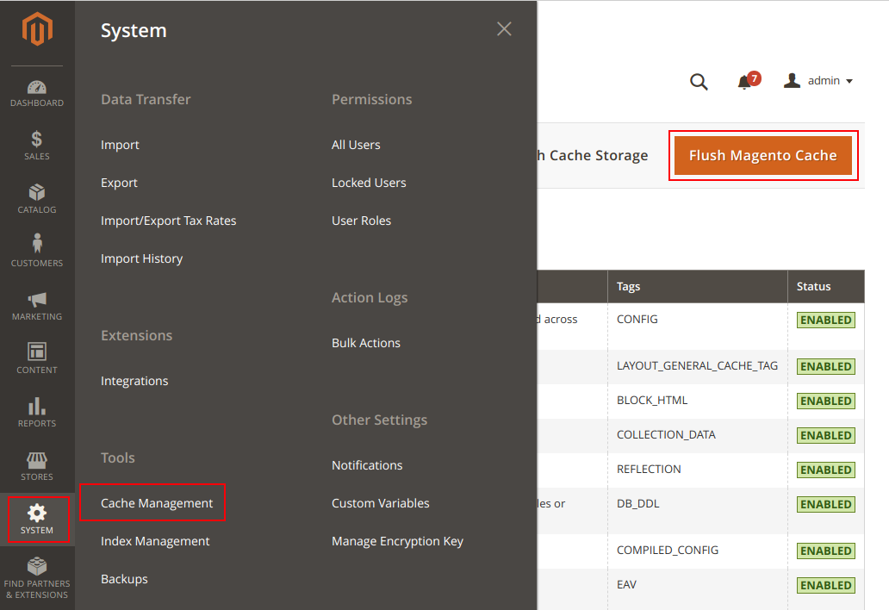
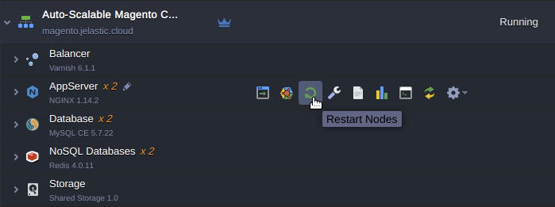
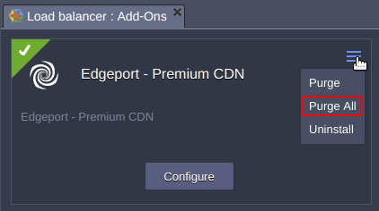

## CORS issue fixing

Installing the **Edgeport - Premium CDN Add-On** on Magento 2 application, you will be experiencing the [**Cross-Origin Resource Sharing (CORS)**](https://en.wikipedia.org/wiki/Cross-origin_resource_sharing) issue which is invoked when a web application executes a cross-origin HTTP request when it requests a resource that has a different origin (domain, protocol, and port) than its own origin.
 
There are several ways how to overcome this issue. One of them we describe here for **NGINX** application server.
Open [Jelastic Configuration Manager](https://docs.jelastic.com/configuration-file-manager) and do the following steps:
   
1. Create new **/etc/nginx/conf.d/cors** directory. 

2. Upload [**cors.conf**](https://raw.githubusercontent.com/sych74/magento/master/CORS-CDN/cors.conf) file from repository directory [**CORS-CDN**](https://github.com/sych74/magento/tree/master/CORS-CDN) to **/etc/nginx/conf.d/cors** directory.
   
3. Open **cors.conf**, find line #5 and replace **SITE_DOMAIN** with your environment hostname.
   
For example: **if ($http_origin ~* 'https?://(localhost|magento\\.jelastic\\.cloud)')** 
   
4. Edit **/etc/nginx/conf.d/site-default.conf** according to provided example [**site-default.conf**](https://raw.githubusercontent.com/sych74/magento/master/CORS-CDN/site-default.conf) from repository directory [**CORS-CDN**](https://github.com/sych74/magento/tree/master/CORS-CDN).
   
5. The changes should be added as the lines **69, 81, 106** and **116** to **/etc/nginx/conf.d/site-default.conf** and look as follows:

line 69: ***include /etc/nginx/conf.d/cors/cors.conf;***  

line 81: ***add_header Access-Control-Allow-Origin "$http_origin";***  

line 106: ***include /etc/nginx/conf.d/cors/cors.conf;***  

line 116: ***add_header Access-Control-Allow-Origin "$http_origin";***

6. Change the URLs in magento admin panel like as on the example picture below in case ***SITE_DOMAIN*** is **magento.jelastic.cloud** and ***CDN_DOMAIN*** generated by Add-On is **magento-demo.cdn.edgeport.net**:

 

7. Clear Magento cache. 

 

  
8. Restart application server to apply changes.
 

 

9. Clear CDN cache with Add-On's built-in feature **Purge All**
  

 

  
10. Wait up to 1 hour for static assets to be propagated across **CDN Points-of-Presence**.

