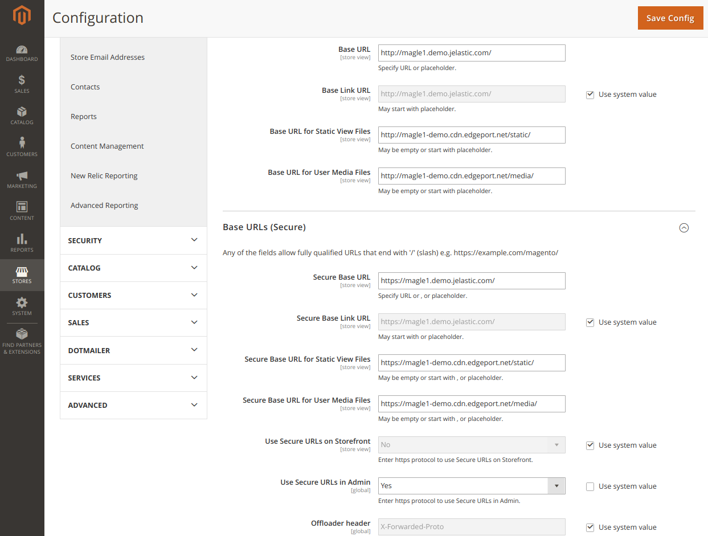

## CORS issue fixing

Installing the **Edgeport - Premium CDN Add-On** on Magento 2 application, you will be experiencing [**Cross-Origin Resource Sharing (CORS)**](https://en.wikipedia.org/wiki/Cross-origin_resource_sharing) issue which is invoked when a web application executes a cross-origin HTTP request when it requests a resource that has a different origin (domain, protocol, and port) than its own origin.
      
There are several ways how to overcome this issue. One of them we describe here.
Open [Jelastic Configuration Manager](https://docs.jelastic.com/configuration-file-manager) and do the following steps:
   
1. Create new **/etc/nginx/conf.d/cors** directory. 

2. Upload **cors.conf** file from repository directory **CORS-CDN** to **/etc/nginx/conf.d/cors** directory.
   
3. Open **cors.conf** , find line #5 and replace **magentohostname** with your environment hostname and **magentocdnhostname** with magento CDN hostname obtained upon Add-On installation.
   
For example: **if ($http_origin ~* 'https?://(localhost|magento\\.jelastic\\.com|magento\\.cdn\\.edgeport\\.net)')** 
   
4. Replace **/etc/nginx/conf.d/site-default.conf** with **site-default.conf** from repository directory **CORS-CDN**.
   
5. The changes added as lines **67, 79, 104** and **113** to **site-default.conf**.

6. Change the URLs in magento admin panel like as on the example picture below.

 

