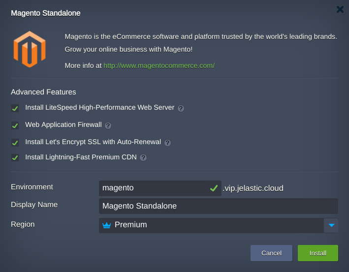
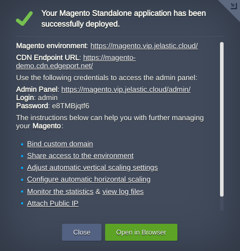

## Magento

Out-of-the-box automated Enterprise Magento application solution for large businesses and mission-critical sites. The JPS package deploys one of two-container topologies:

 - **LEMP** node and **Elasticsearch** node
or
 - **LLSMP** node and **Elasticsearch** node

### Highlights

 **LEMP** is a container that comprises NGINX application server, PHP, MariaDB database server, Redis high-performance RAM-allocated data structure store.  

 **LLSMP** is a container that comprises LiteSpeed application server, PHP, MariaDB database server, Redis high-performance RAM-allocated data structure store.  

This package is designed to deploy Magento environment which represents an open-source e-commerce platform written in PHP. Magento employs the MariaDB relational database management system, the PHP programming language, and elements of the Zend Framework. It applies the conventions of object-oriented programming and model–view–controller architecture. Magento also uses the entity–attribute–value model to store data.

 * **Magento Version**: 2.4 
 * **PHP Engine**: PHP 7.4 
 * **MariaDB Database**: 10.5.8
 * **[LiteMage](https://www.litespeedtech.com/products/cache-plugins/magento-acceleration)** support for LiteSpeed topology. LiteMage - fast, full page caching solution that caches dynamic pages as static files 
 * **[Elasticsearch](https://www.elastic.co/elasticsearch/)** search engine deployed from the official [docker image](https://hub.docker.com/_/elasticsearch) as a separate node. It provides a distributed, multitenant-capable full-text search engine
 

### Deployment

In order to get this solution instantly deployed, click the **DEPLOY TO JELASTIC** button, specify your email address within the widget, choose one of the [Jelastic Public Cloud providers](https://jelastic.cloud) and press Install.

To deploy this package to Jelastic Private Cloud, import [this JPS manifest](manifest.yml) within your dashboard ([detailed instruction](https://docs.jelastic.com/environment-export-import#import)).

More information about Jelastic JPS package and about installation widget for your website can be found in the [Jelastic JPS Application Package](https://github.com/jelastic-jps/jpswiki/wiki/Jelastic-JPS-Application-Package) reference.

If required use Advanced Features:  

  * The *Magento* application can be handled by either **[LiteSpeed Web Server](https://jelastic.com/blog/litespeed-web-server/)**(if chosen) or **[NGINX PHP](https://docs.jelastic.com/nginx-php)** server  
  * **[Web Application Firewall](https://docs.jelastic.com/litespeed-web-server/)** will be enabled by the default if LiteSpeed Web Server will be installed
  * **[Let's Encrypt SSL](https://jelastic.com/blog/free-ssl-certificates-with-lets-encrypt/)** Add-On allows to get your traffic secured and along with LiteSpeed Web Server provides **[HTTP/3](https://docs.jelastic.com/http3)** protocol support. This option stipulates the public IP address will be added to your container  
  * **[Premium CDN](https://jelastic.com/blog/enterprise-cdn-verizon-integration/)** integration in order to provide Lightning-fast static assets loading  

Upon successfull installation, you’ll see an appropriate pop-up with access credentials to your administration Magento panel, whilst the same information will be duplicated to your email box.

More information about Jelastic JPS package and about installation widget for your website can be found in the [Jelastic JPS Application Package](https://github.com/jelastic-jps/jpswiki/wiki/Jelastic-JPS-Application-Package) reference.
