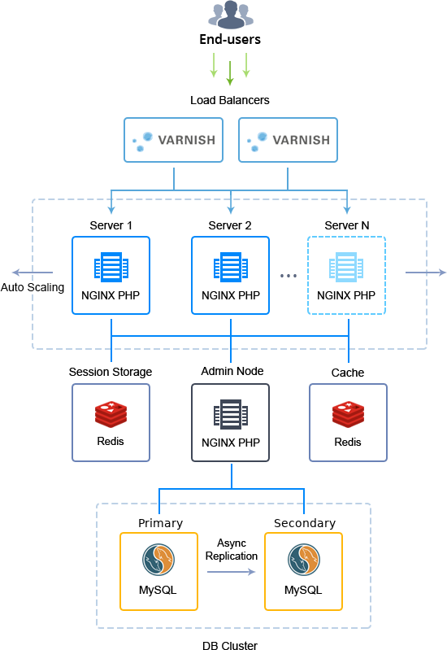
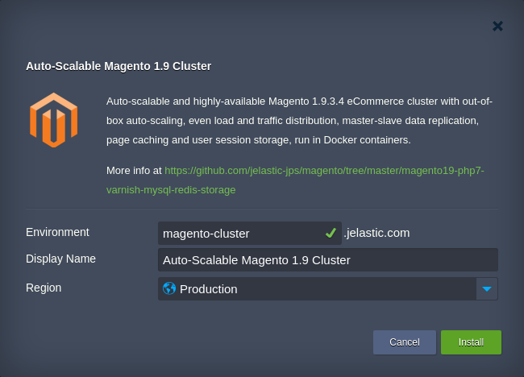
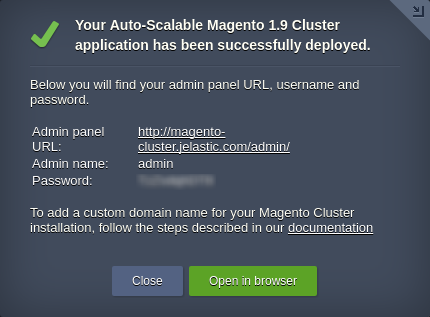

## Please use [**Auto-Scalable Magento Cluster**](https://github.com/jelastic-jps/magento-cluster) as more up-to-date version.

# Auto-Scalable Magento 1.9 Cluster in Docker Containers

Advanced highly reliable and auto-scalable Magento cluster on top of Docker containers with embedded load balancing, a pair of replicated database servers, separate cache & session storages, and dedicated admin node for the whole cluster management.

## Magento 1.9 Cluster Topology Specifics

The current solution utilizes the latest _1.9.3.4_ version of Magento eCommerce platform and a special topology structure, which is designed to provide high availability and consistent performance of your service. It is built of containers based on the following Docker images:

* _Load Balancer_ (LB) - Varnish 4.1.5 (_[jelastic/varnish](https://hub.docker.com/r/jelastic/varnish/)_)

Two Varnish load balancers to distribute incoming traffic within a cluster and cache all static content; are supplemented with NGINX servers as HTTPS proxy

* _Application Server_ (AS) -  NGINX 1.10.1 powered by PHP 7.0.10 (_[jelastic/nginxphp](https://hub.docker.com/r/jelastic/nginxphp/)_)

A pair of NGINX PHP application servers to handle Magento itself; are automatically scaled based on the incoming load

* _Admin Node_ (AN) - NGINX 1.10.1 powered by PHP 7.0.10 (_[jelastic/nginxphp](https://hub.docker.com/r/jelastic/nginxphp/)_)

NGINX PHP admin node to share static content between application server nodes via NFS and to provide access to _Magento Admin_ where orders, catalogs, content, and configurations are managed

* _Session Storage_ (SS) - Redis 3.2.9 (_[devbeta/redis](https://hub.docker.com/r/devbeta/redis/tags/)_)

Redis storage system to retain user session data. In case one AS node fails, the second one can retrieve data from Redis storage and continue serving the current user session  

* _Cache_ (CH) - Redis 3.2.9 (_[devbeta/redis](https://hub.docker.com/r/devbeta/redis/tags/)_)

Redis node node for the Magento content cache storing, which results in the shortened application response time and faster loading of the often requested pages 

* _Database_ (DB) - MySQL 5.7._latest_ (_[jelastic/mysql](https://hub.docker.com/r/jelastic/mysql/)_)

Two MySQL database servers with asynchronous primary-secondary (previously known as master-slave) replication to  achieve high availability, increase data security, and alleviate system failures

Each container within a cluster comes with predefined [vertical scaling](https://docs.jelastic.com/automatic-vertical-scaling) limit up to _**8 cloudlets**_ (equals to 1 GiB of RAM and 3.2 GHz of CPU) and a set of [load alerts](https://docs.jelastic.com/load-alerts) (to notify you when the resources consumption is close to the limit).

Also, when [scaling](https://docs.jelastic.com/multi-nodes) either Load Balancer or Application Server layer, the appropriate LB configs (at either newly created or the already existing instance(s) respectively) are adjusted to include data on all application server nodes the load should be distributed across. In addition, the NGINX application server is automatically scaled by the system horizontally based on the amount of incoming traffic (more details on the appropriate auto-scaling settings are provisioned within the next section).

## Application Server Auto-Scaling Settings

The number of application server nodes in Magento Cluster is adjusted dynamically according to the incoming load by means of [automatic horizontal scaling](https://docs.jelastic.com/automatic-horizontal-scaling). To be more precise, the cluster size is automatically changed under the following conditions:

* _+1 node_ if CPU usage is _more than 70%_ for at least _1 minute_ (up to the maximum allowed containers number per layer)
* _-1 node_ if CPU usage is _less than 20%_ for at least _1 minute_ (down to 2 containers)

The appropriate modifications are automatically applied to add or remove application server nodes, whilst you receive the corresponding email notifications on each scaling operation. Upon creation, each new application server instance is automatically added to the load balancer configs, whilst nodes within the LB layer are restarted to apply the updated settings.

In order to change the conditions of automatic scaling, adjust the default trigger settings by following the [Automatic Horizontal Scaling](https://docs.jelastic.com/automatic-horizontal-scaling) guide.

## How to Deploy Auto-Scalable Magento 1.9 Cluster in Docker Containers

In order to get a clustered Magento 1.9 installation up and running, click the **Deploy to Jelastic** button below and specify your email address in the opened widget. Then, select one of the [Jelastic Public Cloud](https://jelastic.cloud/) providers (in case you don’t have an account at the chosen platform, it will be created automatically) and click **Install**.

Alternatively, you can deploy the package manually by entering your Jelastic dashboard and [importing](https://docs.jelastic.com/environment-import) link to the _**manifest.jps**_ file above.

Within the installation window, type _Environment_ name and optional _Display Name_ ([environment alias](https://docs.jelastic.com/environment-aliases)), select the preferable [region](https://docs.jelastic.com/environment-regions) (if several ones are available) and click **Install**.

Wait a few minutes for Jelastic to prepare and configure an environment. Once the cluster is up, you will see an informational box with your admin data.

Here, you can click **Open in browser** to access the default _Magento Home Page_ or use the link to _Admin Panel_ and start executing the required management functions.

For more information on managing auto-scalable Magneto cluster, refer to the following [article](https://blog.jelastic.com/2017/10/12/transferring-data-to-scalable-magento-cluster/).
