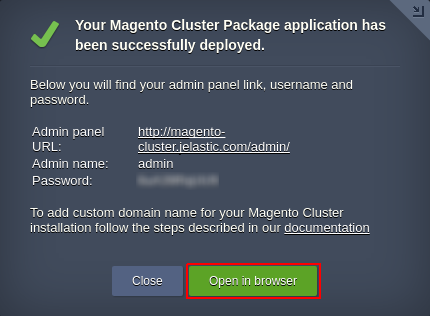

# Auto-Scalable Magento Cluster in Docker Containers

Advanced highly reliable and auto-scalable Magento cluster on top of Docker containers with embedded load balancing, a pair of replicated database servers, separate cache & session storages, and dedicated admin node for the whole cluster management.

## Magento Cluster Topology Specifics

The current auto-scalable Magento Cluster solution topology is designed to provide high availability and consistent performance of your service, being built of containers with the following Docker images:

* _Load Balancer_ (LB) - Varnish 4.1.5 (_[jelastic/varnish](https://hub.docker.com/r/jelastic/varnish/)_)

Two Varnish load balancers to distribute incoming traffic within a cluster and to cache all static content; are supplemented with NGINX servers that are run as a HTTPS proxy

* _Application Server_ (AS) -  NGINX 1.10.1 powered by PHP 7.0.10 (_[jelastic/nginxphp](https://hub.docker.com/r/jelastic/nginxphp/)_)

A pair of NGINX PHP application servers to handle Magento itself; are automatically scaled based on the incoming load

* _Admin Node_ (AN) - NGINX 1.10.1 powered by PHP 7.0.10 (_[jelastic/nginxphp](https://hub.docker.com/r/jelastic/nginxphp/)_)

NGINX PHP admin node to share static content via NFS between application server nodes and to provide access to the *Magento Admin* panel for managing its orders, catalogs, content and configurations

* _Session Storage_ (SS) - Redis 3.2.9 (_[devbeta/redis](https://hub.docker.com/r/devbeta/redis/tags/)_)

Redis storage system to retain user session parameters so that in case one application server instance fails, the second one can retrieve the appropriate data  and continue serving the clients  

* _Cache_ (CH) - Redis 3.2.9 (_[devbeta/redis](https://hub.docker.com/r/devbeta/redis/tags/)_)

Redis node for storing Magento content cache, which helps to improve application response time through faster loading of the often requested pages

* _Database_ (DB) - MySQL 5.7._latest_ (_[jelastic/mysql](https://hub.docker.com/r/jelastic/mysql/)_)

Two MySQL database servers with asynchronous master-slave replication to  achieve high availability, increase data security, and alleviate system failures

Each container within a cluster comes with predefined [vertical scaling](https://docs.jelastic.com/automatic-vertical-scaling) limit up to _**8 cloudlets**_ (equals to 1 GiB of RAM and 3.2 GHz of CPU) and a set of [load alerts](https://docs.jelastic.com/load-alerts) (to notify you when the resources consumption is close to the limit).

Herewith, when [scaling](https://docs.jelastic.com/multi-nodes) either Load Balancer or Application Server layer, the appropriate LB configs (at either newly created or the already existing instance(s) respectively) are automatically adjusted to include data on all application server nodes the load should be distributed across. In addition, NGINX application server is automatically scaled by the system horizontally based on the amount of incoming traffic, which enables it to handle the changeable load.

## Application Server Auto-Scaling Settings

The number of application server nodes in Magento Cluster is adjusted dynamically according to the incoming load by means of [automatic horizontal scaling](https://docs.jelastic.com/automatic-horizontal-scaling). To be more precise, the cluster size is automatically changed according to the following conditions:

* _+1 node_ if CPU usage is _more than 70%_ for at least _1 minute_
* _-1 node_ if CPU usage is _less than 20%_ for at least _1 minute_

The appropriate modifications are automatically applied to add or remove application server nodes, whilst you receive the corresponding email notifications on each scaling operation. Upon creation, each new application server instance is automatically added to the load balancer configs, whilst nodes within the LB layer are restarted to apply the updated settings.

In order to change the conditions of automatic scaling, adjust the default trigger settings by following the [Automatic Horizontal Scaling](https://docs.jelastic.com/automatic-horizontal-scaling) guide.

## How to Deploy Auto-Scalable Magento Cluster in Docker Containers

In order to get Magento Cluster up and running, click the **Deploy to Jelastic** button below and specify your email address in the opened widget. Then, select one of the [Jelastic Public Cloud](https://jelastic.cloud/) providers (in case you don’t have an account at the chosen platform, it will be created automatically) and click **Install**.

Alternatively, you can deploy the package manually by entering your Jelastic dashboard and [importing](https://docs.jelastic.com/environment-import) link to the _**manifest.jps**_ file above.

Within the installation window, type _Environment_ name and optional _Display Name_ ([environment alias](https://docs.jelastic.com/environment-aliases)), select the preferable [region](https://docs.jelastic.com/environment-regions) (if several ones are available) and click **Install**.

Wait a few minutes for Jelastic to prepare and configure an environment. Once the cluster is up, you'll see an informational box with your admin data.

Here, you can click **Open in browser** to access the _Magento Admin Panel_ and start executing the required management functions.
