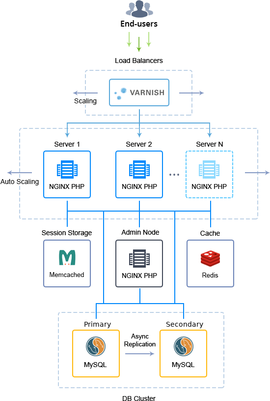

# **Highly Available and Auto-Scalable Magento2.2 Cluster (beta version)**

Advanced highly reliable and auto-scalable Magento cluster on top of Docker containers with embedded load balancing, a pair of replicated database servers, separate cache & session storages, and dedicated admin node for the whole cluster management.

**Highlights:**

* varnish node caches all static content, so most of the traffic concentrates on this node.

* balancer layer has horizontal scaling. After a new balancer node addition, Cloud Scripting automatically adds all compute nodes to the balancer config;

* PHP-FPM nodes are responsible for auto horizontal scaling (i.e. adding/removing nodes according to the load). Scaling condition - 70% CPU consumption level, kept for 1 minute.

* after a new node addition, Cloud Scripting automatically adds this node to balancers’ configs and reloads them;

* admin node in topology is responsible for sharing static content via NFS between all compute nodes and provides access to the admin panel;

* asynchronous master-slave replication is configured between MySQL databases;

* memcached node for sessions storage;

* redis node is added for cache storage;

* all stacks used in current topology are based on Jelastic dockerized templates.

**Docker images list used in Magento Cluster:**

* jelastic/varnish:4.1.8

* jelastic/nginxphp:1.10.1-php-7.0.21

* jelastic/mysql:5.7-latest

* jelastic/memcached:1.4.24

* devbeta/redis:3.2.9

### **Specifics**

<table>
  <tr>
    <td>Layer</td>
    <td>Server</td>
    <td>Number of CTs
by default</td>
    <td>Cloudlets per CT
(reserved/dynamic)</td>
  </tr>
  <tr>
    <td>LB</td>
    <td>Varnish(+Nginx 443 port)</td>
    <td>2</td>
    <td>1/8</td>
  </tr>
  <tr>
    <td>AS</td>
    <td>Nginx (PHP-FPM)</td>
    <td>2</td>
    <td>1/8</td>
  </tr>
  <tr>
    <td>DB</td>
    <td>MySQL</td>
    <td>2</td>
    <td>1/8</td>
  </tr>
  <tr>
    <td>AN</td>
    <td>Nginx (PHP-FPM)</td>
    <td>1</td>
    <td>1/8</td>
  </tr>
  <tr>
    <td>CH</td>
    <td>Redis</td>
    <td>1</td>
    <td>1/8</td>
  </tr>
  <tr>
    <td>SS</td>
    <td>Memcached</td>
    <td>1</td>
    <td>1/8</td>
  </tr>
</table>

* LB - Load balancer

* AS - Application server

* DB - Database

* AN - Admin node

* CH - Cache

* SS - Session Storage

* CT - Container

**Magento Version**: 2.2.0

**Varnish Version**: 4.1.8

**Nginx Version**: 1.10.1

**Php Version**: PHP 7

**MySQL Database**: 5.7.14

**Redis Version**: 3.2.9

**Memcached Version:** 1.4.24

## Magento Cluster Topology Specifics

The current auto-scalable Magento Cluster solution topology is designed to provide high availability and consistent performance of your service, being built of containers with the following Docker images:

* Load Balancer (LB) - Varnish 4.1.8 ([jelastic/varnish](https://hub.docker.com/r/jelastic/varnish/))

Two Varnish load balancers to distribute incoming traffic within a cluster and to cache all static content; are supplemented with NGINX servers that are run as a HTTPS proxy

* Application Server (AS) - NGINX 1.10.1 powered by PHP 7.0.21 ([jelastic/nginxphp](https://hub.docker.com/r/jelastic/nginxphp/))

A pair of NGINX PHP application servers to handle Magento itself; are automatically scaled based on the incoming load

* Admin Node (AN) - NGINX 1.10.1 powered by PHP 7.0.21 ([jelastic/nginxphp](https://hub.docker.com/r/jelastic/nginxphp/))

NGINX PHP admin node to share static content via NFS between application server nodes and to provide access to the Magento Admin panel for managing its orders, catalogs, content and configurations

* Session Storage (SS) - Memcached 1.4.24 ([jelastic/memcached](https://hub.docker.com/r/jelastic/memcached/tags/))

Memcache storage system to retain user session parameters so that in case one application server instance fails, the second one can retrieve the appropriate data and continue serving the clients

* Cache (CH) - Redis 3.2.9 ([devbeta/redis](https://hub.docker.com/r/devbeta/redis/tags/))

Redis node for storing Magento content cache, which helps to improve application response time through faster loading of the often requested pages

* Database (DB) - MySQL 5.7.latest ([jelastic/mysql](https://hub.docker.com/r/jelastic/mysql/))

Two MySQL database servers with asynchronous master-slave replication to achieve high availability, increase data security, and alleviate system failures

Each container within a cluster comes with predefined[ vertical scaling](https://docs.jelastic.com/automatic-vertical-scaling) limit up to 8 cloudlets (equals to 1 GiB of RAM and 3.2 GHz of CPU) and a set of[ load alerts](https://docs.jelastic.com/load-alerts) (to notify you when the resources consumption is close to the limit).

Herewith, when[ scaling](https://docs.jelastic.com/multi-nodes) either Load Balancer or Application Server layer, the appropriate LB configs (at either newly created or the already existing instance(s) respectively) are automatically adjusted to include data on all application server nodes the load should be distributed across. In addition, NGINX application server is automatically scaled by the system horizontally based on the amount of incoming traffic, which enables it to handle the changeable load.

## Application Server Auto-Scaling Settings

The number of application server nodes in Magento Cluster is adjusted dynamically according to the incoming load by means of[ automatic horizontal scaling](https://docs.jelastic.com/automatic-horizontal-scaling). To be more precise, the cluster size is automatically changed according to the following conditions:

* +1 node if CPU usage is more than 70% for at least 1 minute
* -1 node if CPU usage is less than 20% for at least 1 minute

The appropriate modifications are automatically applied to add or remove application server nodes, whilst you receive the corresponding email notifications on each scaling operation. Upon creation, each new application server instance is automatically added to the load balancer configs, whilst nodes within the LB layer are restarted to apply the updated settings.

In order to change the conditions of automatic scaling, adjust the default trigger settings by following the[ Automatic Horizontal Scaling](https://docs.jelastic.com/automatic-horizontal-scaling) guide.
